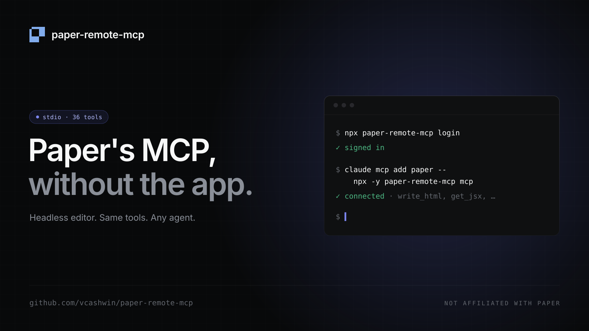

# paper-remote-mcp

Run [Paper](https://paper.design)'s MCP server without the desktop app.



`paper-remote-mcp` loads the Paper editor in a headless browser, signed in as you, and exposes the same tools Paper Desktop does (`write_html`, `get_screenshot`, `get_jsx`, `create_file`, …) over stdio. It works with Claude Code, Cursor, Codex, or any MCP client.

```bash
npx paper-remote-mcp login    # one-time OAuth sign-in
npx paper-remote-mcp doctor   # check browser, sign-in, tools
claude mcp add paper -- npx -y paper-remote-mcp mcp
```

> Community project. Not affiliated with or endorsed by Paper.

## Requirements

- Node 20+
- Google Chrome, or Playwright's Chromium (`npx playwright install chromium`)

## Setup

**1. Sign in.** `npx paper-remote-mcp login` opens a browser window at `app.paper.design`. Sign in as usual; the session is saved to `~/.paper-mcp/profiles/production/` and reused headlessly.

**2. Verify.**

```
$ npx paper-remote-mcp doctor
browser        ✓ launched
sign-in        ✓ authenticated (Paper API /auth/me → 200)
handlers       ✓ 36 tools available
```

**3. Add it to your agent.**

<details open>
<summary>Claude Code</summary>

```bash
claude mcp add paper -- npx -y paper-remote-mcp mcp
```

</details>

<details>
<summary>Cursor — <code>~/.cursor/mcp.json</code></summary>

```json
{ "mcpServers": { "paper": { "command": "npx", "args": ["-y", "paper-remote-mcp", "mcp"] } } }
```

</details>

<details>
<summary>Codex — <code>~/.codex/config.toml</code></summary>

```toml
[mcp_servers.paper]
command = "npx"
args = ["-y", "paper-remote-mcp", "mcp"]
```

</details>

<details>
<summary>VS Code — <code>.vscode/mcp.json</code></summary>

```json
{ "servers": { "paper": { "type": "stdio", "command": "npx", "args": ["-y", "paper-remote-mcp", "mcp"] } } }
```

</details>

To open a specific file on start, append `--file <fileId-or-url>` to the args.

## Commands

| Command            | What it does                                              |
| ------------------ | --------------------------------------------------------- |
| `mcp` _(default)_  | Start the stdio MCP server backed by a headless editor.   |
| `login` / `logout` | Sign in, or delete the saved session.                     |
| `doctor`           | Check Node, browser, sign-in, and tool availability.      |
| `relay`            | Forward stdio to a _running_ Paper Desktop (no CLI binary needed). |

| Flag               | Meaning                                     |
| ------------------ | ------------------------------------------- |
| `--file <id\|url>` | File to open and use as the default target. |
| `--env <name>`     | `production` (default) or `staging`.        |
| `--profile <dir>`  | Override the session directory.             |
| `--headful`        | Show the browser window.                    |

Env vars: `PAPER_MCP_ENV`, `PAPER_MCP_PROFILE`, `PAPER_MCP_LOG` (`silent|error|warn|info|debug`).

## How it works

Paper Desktop's MCP server is a thin proxy: every tool call runs against `window.mcpHandlers` inside the editor page. Paper only builds those handlers in the desktop shell or in a browser that supports WebMCP.

`paper-remote-mcp` injects a no-op `navigator.modelContext` before the page loads. Paper then builds its real handlers and keeps using normal cookie auth. The stdio server maps `tools/list` to `getMCPServerConfig()` and `tools/call` to `handleToolCall()`, and navigates to another file when a tool call names a different `fileId`. The tool list and instructions come from Paper itself, so they stay in sync with Paper's updates.

## Limitations

- One file is open at a time; switching files costs a page reload.
- The headless browser takes a few seconds to start and uses a few hundred MB of RAM.
- It depends on Paper's web internals. If Paper changes them, `doctor` will report it.
- It uses its own Chrome profile, not your everyday one: Chrome locks a profile to one process and blocks automation of the default profile.

## Troubleshooting

- **"Profile is in use by another browser":** your agent is already running the server. Quit it, or pass a different `--profile`.
- **Not signed in after `login`:** run `login` again and wait for `✓ Signed in`. If Google sign-in is refused, use **Continue with email**.
- **Switch accounts:** `logout`, then `login`.

## Programmatic API

```js
import { createEditorHost } from 'paper-remote-mcp';

const host = await createEditorHost({ fileId: '…' });
await host.start();
const result = await host.handleToolCall('agent-1', 'get_basic_info', {}, { name: 'my-app' });
await host.close();
```

## Development

```bash
git clone https://github.com/vcashwin/paper-remote-mcp && cd paper-remote-mcp
npm install
node src/cli.js login     # one-time sign-in (skip if already signed in)
node src/cli.js doctor    # browser ✓, sign-in ✓, 36 tools ✓
npm run typecheck
```

Point your agent at the local checkout so code changes apply on the next server start:

```bash
# Claude Code (user scope = every project)
claude mcp add -s user paper-remote -- node "$PWD/src/cli.js" mcp
claude mcp get paper-remote          # should show ✔ Connected

# Codex
codex mcp add paper-remote -- node "$PWD/src/cli.js" mcp
```

Or for Codex, add this to `~/.codex/config.toml`:

```toml
[mcp_servers.paper-remote]
command = "node"
args = ["/absolute/path/to/paper-remote-mcp/src/cli.js", "mcp"]
```

Only one server can use a profile at a time. To run Claude and Codex together, give one its own with `--profile ~/.paper-mcp/codex` (and run `login` with that profile once).

MIT © vcashwin
